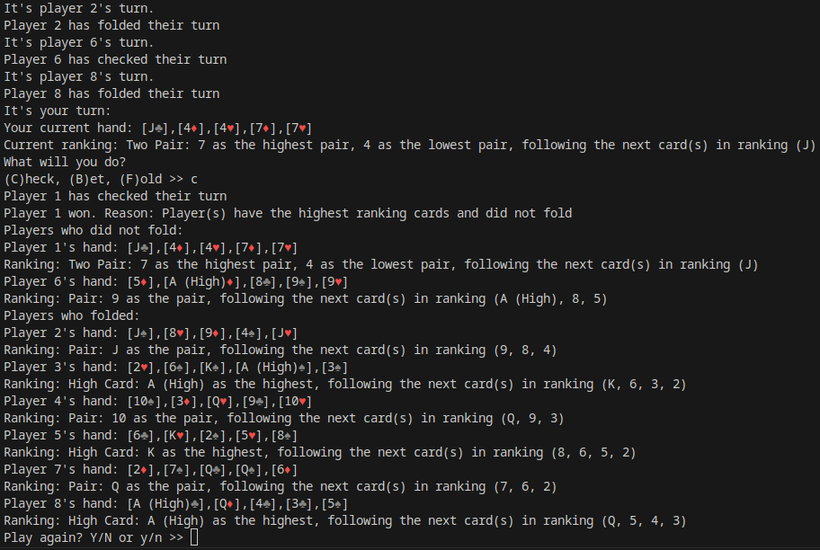

# Python Poker Terminal Game Project
This project is to create a terminal program on python for https://www.codecademy.com as part of my `Portfolio Project: Python Terminal Game` project.

To start the program, type in the shell `python main.py`

One reason for making this was that I wanted to see how the math works in ranking poker hands. I wrote code to determine the hand rankings based on the highest frequency numbered cards (Including the second highest frequency numbered card involving Two Pair or a Full House), or if the hand is a Straight (sequentially numbered cards), or a Flush (all the same suit).

Another reason for making this was to try to make "Computer AI" to replace their cards for better hand rankings, and set probabilities of actions in poker (Such as Folding, Betting, Raising, Calling, and Checking), based on their current hand. There is no concept of money involved in the program, you can freely do the poker actions above.

I have used the following resources to try to make this program:
https://www.youtube.com/watch?v=ue8aWitj_mk
https://en.wikipedia.org/wiki/List_of_poker_hands

Here is a screenshot of the program:

In conclusion, I had fun making this. There were some game logic errors I had to fix and python-related errors (Such as misnaming class fields or using type objects improperly) throughout the program. Regardless, this was an interesting project to try to make.